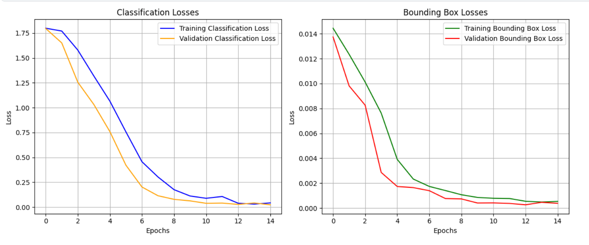
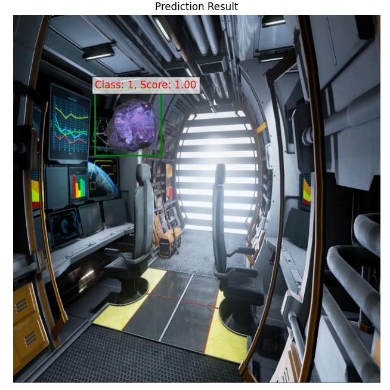
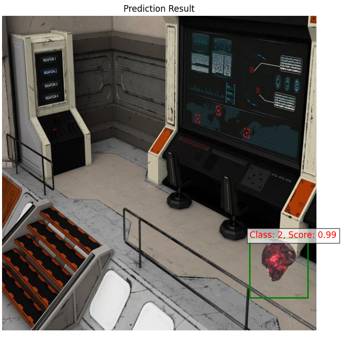

# custom-object-detector-marvel-stones
This project features a custom convolutional neural network trained to detect Marvel Infinity Stones.

A custom synthetic dataset was created by crawling diverse background images and overlaying Marvel stone images onto them, simulating realistic scenes to address the scarcity of real training data.

The model architecture is a custom CNN implemented in PyTorch as CustomModel, consisting of four convolutional layers followed by fully connected layers to output both class probabilities and bounding box coordinates for accurate stone detection.

## Training VS Validation Losses: 

## Example Detection

